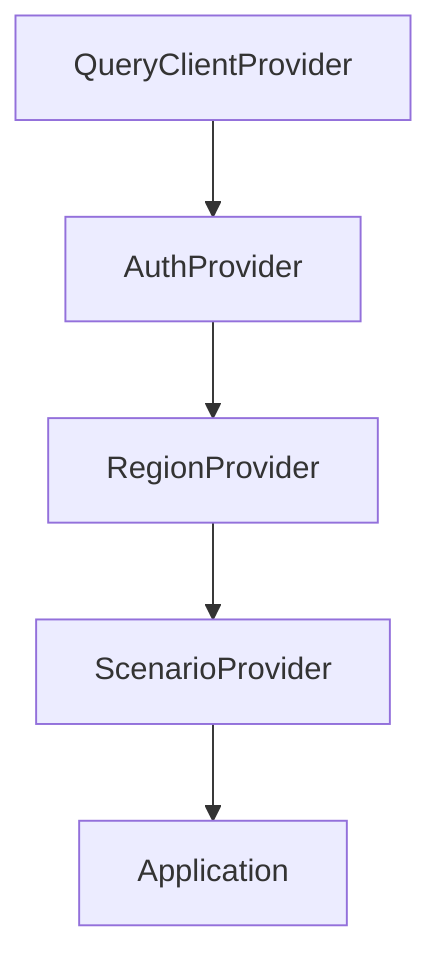

# AquaForecast-HUB - Project Review

## 📋 Executive Summary

**Project Name:** AquaForecast-HUB  
**Type:** Full-Stack Water Demand Forecasting Application  
**Primary Purpose:** ML-powered water demand prediction and analytics dashboard  
**Review Date:** February 3, 2026  
**Branch:** sd-development  

---

## 🏗️ Architecture Overview

### Technology Stack

| Layer | Technology |
|-------|------------|
| **Frontend** | React 18, TypeScript, Vite |
| **UI Framework** | shadcn/ui, Radix UI, Tailwind CSS |
| **State Management** | React Context API, TanStack React Query |
| **Charting** | Recharts |
| **Backend** | FastAPI (Python) |
| **ML Framework** | scikit-learn, NumPy, Pandas |
| **Containerization** | Docker, Docker Compose |

### Project Structure

```
aquaforecast-hub/
├── src/                    # Frontend React application
│   ├── components/         # Reusable UI components
│   ├── contexts/           # React Context providers
│   ├── hooks/              # Custom React hooks
│   ├── pages/              # Page components (routes)
│   ├── services/           # API service layer
│   ├── data/               # Mock data utilities
│   └── lib/                # Utility functions
├── ml-backend/             # Python FastAPI backend
│   ├── app.py              # Main API server
│   ├── models/             # ML models and data
│   └── requirements.txt    # Python dependencies
└── public/                 # Static assets
```

---

## ✅ Strengths

### 1. **Well-Structured Frontend Architecture**
- Clean separation of concerns with dedicated folders for components, contexts, hooks, and services
- Proper use of React Context for state management (`AuthContext`, `RegionContext`, `ScenarioContext`)
- Custom hooks (`useForecast`, `useRegions`, `useAPIHealth`) for reusable API logic
- TypeScript for type safety throughout the application

### 2. **Comprehensive UI Component Library**
- Extensive use of shadcn/ui with 40+ pre-built components
- Consistent design system using Tailwind CSS with CSS variables
- Dark mode support via `next-themes`
- Responsive design with mobile support (`use-mobile` hook)

### 3. **Robust API Integration**
- Well-designed TypeScript service layer (`forecastAPI.ts`) with:
  - Strong type definitions (`ForecastRequest`, `ForecastResponse`, `APIError`)
  - Built-in caching (5-minute TTL)
  - Request timeout handling
  - Error handling with structured error types

### 4. **Production-Ready Backend**
- FastAPI server with comprehensive features:
  - Pydantic validation for request/response schemas
  - CORS configuration for frontend integration
  - Rate limiting (100 requests/minute)
  - In-memory caching (1-hour TTL)
  - Health check endpoint
  - Request logging
- Pre-configured region data for multiple countries/states

### 5. **DevOps & Deployment**
- Docker Compose configuration for local development
- Separate containers for frontend and ML backend
- Health checks configured for the backend service
- Vite for fast development builds

### 6. **Feature-Rich Application**
- **Dashboard:** KPI cards, charts, real-time data display
- **ML Forecast:** Country/region input with confidence intervals
- **Prediction:** Time-series visualization with period filtering
- **Scenario Analysis:** Dynamic risk calculation based on input parameters
- **Authentication:** Role-based access (admin, analyst, viewer)
- **Data Export:** CSV export functionality

---

## ⚠️ Areas for Improvement

### 1. **Security Concerns**

| Issue | Severity | Recommendation |
|-------|----------|----------------|
| No real authentication backend | High | Implement JWT-based auth or OAuth integration |
| Hardcoded CORS origins | Medium | Use environment variables for allowed origins |
| Client-side only auth check | High | Add server-side token validation |
| No HTTPS enforcement | Medium | Add SSL/TLS configuration |

```tsx
// Current auth implementation (client-side only)
const login = (email: string, password: string, role: UserRole): boolean => {
  if (email && password.length >= 4) {  // Weak validation
    setUser({ ... });
    return true;
  }
};
```

### 2. **ML Model Integration**
- **Missing Actual Model:** The `models/` folder contains CSV data but no trained `.pkl` model file
- **Mock Predictions:** Backend uses region-specific baseline data instead of actual ML inference
- **No Model Versioning:** Consider implementing MLflow or similar for model management

### 3. **Code Quality**

| Item | Status | Notes |
|------|--------|-------|
| Unit Tests | ⚠️ Minimal | Only `example.test.ts` exists |
| API Tests | ❌ Missing | No integration tests for backend |
| E2E Tests | ❌ Missing | Consider Playwright or Cypress |
| Error Boundaries | ❌ Missing | Add React error boundaries |
| Logging | ⚠️ Basic | Consider structured frontend logging |

### 4. **Performance Optimizations**
- No lazy loading for page components
- Missing React.memo optimization on expensive components
- Consider implementing virtual scrolling for large data sets
- Add service worker for offline capability

### 5. **Database & Persistence**
- No database integration (using in-memory cache only)
- User sessions not persisted
- Forecast history not stored
- Recommendation: Add PostgreSQL or MongoDB for data persistence

### 6. **Documentation**
- README is generic (Lovable template)
- Missing API documentation (consider Swagger/OpenAPI)
- No component documentation (consider Storybook)
- Missing deployment guide

---

## 📊 Code Metrics

### Frontend Dependencies (Key)
| Package | Version | Purpose |
|---------|---------|---------|
| react | ^18.3.1 | UI Library |
| typescript | (devDep) | Type Safety |
| @tanstack/react-query | ^5.83.0 | Server State |
| recharts | ^2.15.4 | Data Visualization |
| framer-motion | ^12.26.2 | Animations |
| zod | ^3.25.76 | Schema Validation |

### Backend Dependencies
| Package | Version | Purpose |
|---------|---------|---------|
| fastapi | 0.109.0 | Web Framework |
| uvicorn | 0.27.0 | ASGI Server |
| scikit-learn | 1.4.0 | ML Library |
| pandas | 2.2.0 | Data Processing |

---

## 🗺️ Feature Analysis

### Pages Implemented

| Page | Status | Features |
|------|--------|----------|
| Dashboard | ✅ Complete | KPIs, charts, location selector, ML integration |
| ML Forecast | ✅ Complete | Region input, forecast display, export |
| Prediction | ✅ Complete | Time-series chart, period filtering |
| Scenario | ✅ Complete | Parameter adjustment, risk analysis |
| Data Upload | ⚠️ Partial | UI exists, needs backend integration |
| Ask AI | ⚠️ Partial | UI exists, needs AI/LLM integration |
| Performance | ⚠️ Partial | Needs metrics implementation |
| Comparison | ⚠️ Partial | Needs multi-region comparison logic |
| Help | ⚠️ Partial | Documentation needed |

### Context Providers



---

## 🔧 Recommendations

### Immediate (High Priority)

1. **Implement Real Authentication**
   ```typescript
   // Add proper JWT handling
   const login = async (email: string, password: string) => {
     const response = await fetch('/api/auth/login', {...});
     const { token, user } = await response.json();
     localStorage.setItem('token', token);
     setUser(user);
   };
   ```

2. **Train and Deploy ML Model**
   - Use the existing Jupyter notebook (`water_demand_model.ipynb`) to train a model
   - Export to `.pkl` format
   - Update `app.py` to load and use the model for predictions

3. **Add Test Coverage**
   ```bash
   # Target: 70%+ code coverage
   npm run test:coverage
   ```

### Short-Term (Medium Priority)

4. **Add Error Boundaries**
5. **Implement Lazy Loading**
   ```typescript
   const Dashboard = lazy(() => import('./pages/Dashboard'));
   ```
6. **Add API Documentation with Swagger**
7. **Set up CI/CD Pipeline**

### Long-Term (Low Priority)

8. **Add Database (PostgreSQL recommended)**
9. **Implement Real-time Updates (WebSockets)**
10. **Add Internationalization (i18n)**
11. **PWA Support for Offline Access**

---

## 📈 Scalability Considerations

| Aspect | Current | Recommended |
|--------|---------|-------------|
| Caching | In-memory | Redis cluster |
| Database | None | PostgreSQL + read replicas |
| API | Single instance | Load-balanced containers |
| ML Inference | Sync | Async with job queue (Celery) |
| Monitoring | None | Prometheus + Grafana |

---

## 🎯 Conclusion

**Overall Assessment: 7.5/10**

AquaForecast-HUB is a well-architected full-stack application with a solid foundation. The frontend demonstrates excellent use of modern React patterns, TypeScript, and UI libraries. The FastAPI backend is production-ready with proper middleware configuration.

**Key Strengths:**
- Clean, maintainable code structure
- Strong TypeScript usage
- Comprehensive UI component library
- Good separation of concerns

**Primary Gaps:**
- Authentication is client-side only (security risk)
- ML model not deployed (using baseline data)
- Minimal test coverage
- Missing database layer

With the recommended improvements, this project would be ready for production deployment and could effectively serve as a water demand forecasting solution.

---
